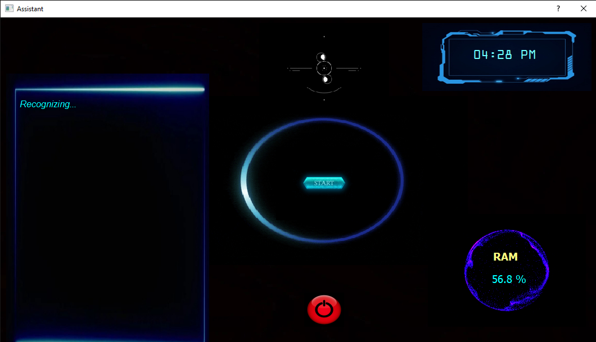

<h1 align="center">Voice Assistant Using Python</h3>

  <p align="center">
    We have always been amazed by how technology is advancing day 
by day. From Eniac's first digital computer with a clock speed of 100 
kHz to the summit developed by the US Department of Energy, the 
performance is 148.6 petaflops. It would not worth it if people are 
still struggling to communicate with their machines using different 
input devices in such an advanced era. Many voice assistants have 
been developed to address this issue and are being improved to 
improve performance.With Voice Assistant, you can reduce the use 
of input devices such as keyboards, mouse, and touch pans. Hardware
consumption will reduce by using this.
  </p>


<!-- ABOUT THE PROJECT -->
## About The Project
The main objective is building a personal voice assistant software (a virtual assistant) by 
using the data available on the web, user-generated content, and then providing knowledge 
from an internet.
The assistant we have developed is based on Python open source modules/libraries. This is 
project is just a basic version of voice assistant. It can be enhanced in the future by 
incorporating Machine learning and the Internet of Things.
All you need to do is to give a voice command and the rest will be done by the assistant. 
There is no need to give inputs by touching when you can give in form of voice. With the 
help of Machine learning, supervised, unsupervised and reinforcement learning can be done 
for further advancement.
One of the main advantages of voice searches is that we can write about 40 words per minute, 
whereas we are capable of speaking around 150 words during the same period of time. As 
we see, voice search would be fast and time saving.


### Built With

* <strong>Python<strong>
* <strong>Qt<strong>
* <strong>HTML<strong>
* <strong>CSS<strong>


<!-- GETTING STARTED -->
## Getting Started


### Installation

1. Clone the repo
   ```sh
   git clone https://github.com/Shahzad1729/Voice-Assistant-Using-Python.git
   ```
2. Run 
   ```sh
   Assistant.py
   ```


<!-- Feature -->
## Features
- [ ] Searching on Wikipedia
- [ ] Searching on YouTube
- [ ] Searching on Google
- [ ] Opening Applications Like VS Code, Notepad etc..
- [ ] Closing Applications like Web Browser, Notepad, Music Player etc..
- [ ] Playing Music
- [ ] Weather Update (Temp)
- [ ] Check Current IP Address
- [ ] Taking Notes in Notepad
- [ ] Searching General Knowledge Question (Wolframalpha API)
- [ ] Sending an Email
- [ ] Sending Message on WhatsApp
- [ ] Organizing Files According to their type (Docs, Image, Video, Audio, Others)
- [ ] Taking Screenshot
- [ ] Hiding Files
- [ ] Basic Arithmatic Calculation
- [ ] Google Translate (English to : Hindi or Marathi or Urdu)
- [ ] Brightness Control
- [ ] Switching Night Light (Windows 10)
- [ ] Get Current Price of Bitcoin


<!-- Image -->
## Image
<a href="https://github.com/Shahzad1729/Voice-Assistant-Using-Python">
    
  </a>


<!-- Limitations -->
## Limitations

<strong>1. Background noise and loud environments:<strong>
<p>Too much background noise can challenge speech recognition. It would be hard to use 
in the urban outdoors or large public spaces/offices. Good quality microphone or headset 
can reduce the limitations.</p>

<strong>2. Accents and local differences:<strong>
<p>Voice assistants are sometimes challenged by diversity in voice inputs. Especially the 
accents. While systems are getting better there’s still a problem in the ability to understand 
American or Scottish English. Even a simple cold can cause the voice commands not to 
work.</p>

<strong>3. Slow internet connection:<strong>
<p>Sometimes internet connection might be slow, so there might be delayed in getting the 
desired results.</p>
